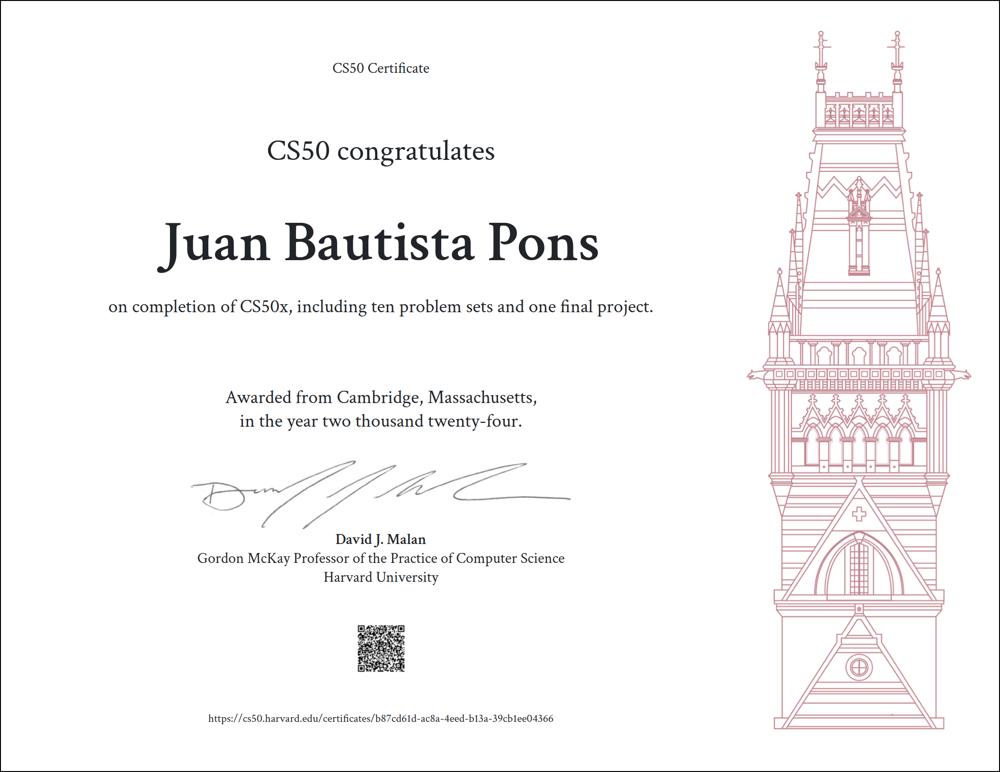

# CS50’s Introduction to Computer Science

### These are my solutions for CS50's Introduction to Computer Science.
 
### 💻 Final Project: [Currencity](https://www.youtube.com/watch?v=gSLRo04L0h4&t=15s)
 

## :warning: Disclaimer:

### ❗ **The following codes are for educational purpose only and not intended to be used / submitted as your own solutions.**

### ❗ **Cheating violates the [Academic Honesty](https://cs50.harvard.edu/x/2024/honesty/) of the course, not to mention it's totally pointless if you actually want to learn programming.**

 

## Table of Contents
### [Week 0](/Week%200/) - [Scratch](https://cs50.harvard.edu/x/2024/weeks/0/)
- [Scratch](/Week%200/)

### [Week 1](/Week%201/) - [C](https://cs50.harvard.edu/x/2024/weeks/1/)
- [Hello, World](/Week%201/world/)
- [Hello, It’s Me](/Week%201/me/)
- [Mario (less)](/Week%201/mario-less/)
- [Mario (more)](/Week%201/mario-more/)
- [Cash](/Week%201/cash/)
- [Credit](/Week%201/credit/)

### [Week 2](/Week%202/) - [Arrays](https://cs50.harvard.edu/x/2024/weeks/2/)
- [Scrabble](/Week%202/scrabble/)
- [Readability](/Week%202/readability/)
- [Caesar](/Week%202/caesar/)
- [Substitution](/Week%202/substitution/)

### [Week 3](/Week%203/) - [Algorithms](https://cs50.harvard.edu/x/2024/weeks/3/)
- [Sort](/Week%203/sort/)
- [Plurality](/Week%203/plurality/)
- [Runoff](/Week%203/runoff/)
- [Tideman](/Week%203/tideman/)

### [Week 4](/Week%204/) - [Memory](https://cs50.harvard.edu/x/2024/weeks/4/)
- [Volume](/Week%204/volume/)
- [Filter (less)](/Week%204/filter-less/)
- [Filter (more)](/Week%204/filter-more/)
- [Recover](/Week%204/recover/)

### [Week 5](/Week%205/) - [Data Structures](https://cs50.harvard.edu/x/2024/weeks/5/)
- [Inheritance](/Week%205/inheritance/)
- [Speller](/Week%205/speller/)

### [Week 6](/Week%206/) - [Python](https://cs50.harvard.edu/x/2024/weeks/6/)
- [Hello, Again](/Week%206/sentimental/hello/)
- [Mario (less)](/Week%206/sentimental/mario/less/)
- [Mario (more)](/Week%206/sentimental/mario/more/)
- [Cash](/Week%206/sentimental/cash/)
- [Credit](/Week%206/sentimental/credit/)
- [Readability](/Week%206/sentimental/readability/)
- [DNA](/Week%206/dna/)

### [Week 7](/Week%207/) - [SQL](https://cs50.harvard.edu/x/2024/weeks/7/)
- [Songs](/Week%207/songs/)
- [Movies](/Week%207/movies/)
- [Fiftyville](/Week%207/fiftyville/)

### [Week 8](/Week%208/) - [HTML, CSS, JavaScript](https://cs50.harvard.edu/x/2024/weeks/8/)
- [Trivia](/Week%208/trivia/)
- [Homepage](/Week%208/homepage/)

### [Week 9](/Week%209/) - [Flask](https://cs50.harvard.edu/x/2024/weeks/9/)
- [Birthdays](/Week%209/birthdays/)
- [C$50 Finance](/Week%209/finance/)
